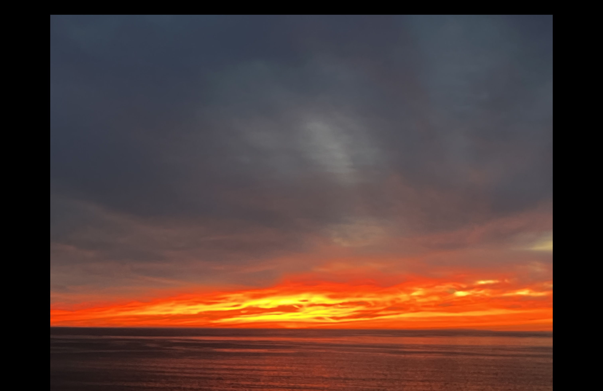

## ***Indroduction***
Hi! I am Shambhavi Mittal and I am a second-year Computer Science student at University of California, San Diego. My interests are in *Internet Security, Machine learning and Computer Graphics*. Although I have only done some basic projects in these fields, I look forward delving more into specific domains. 

## ***Skills***
- Python
- C++
- Java
- C
- Git
- Latex
- SQL
- OpenGL
- ARM Assembly
- Communication
- Teamwork


If you are curious to know about my adventurous goals in life, [Click Here!](#things-i-want-to-before-i-die)

>I one the main reasons I chose to stduy at UCSD was because of the beautiful sunsets! Here are some of the sunets I captured:




My favorite python Library is:

```
import matplotlib
```

## ***Things I want to before I die:***
- [X] Study in the USA
- [ ] Travel to Greece
- [ ] Attend a research conference
- [ ] Skydiving
- [ ] Deep sea diving
- [ ] Skiing

## ***Connect with me***
1. [Github](https://github.com/shambhavi-20)
2. [LinkedIn](www.linkedin.com/in/shambhavi-mittal-035957216)

## ***Relative Links***
[README](README.md)